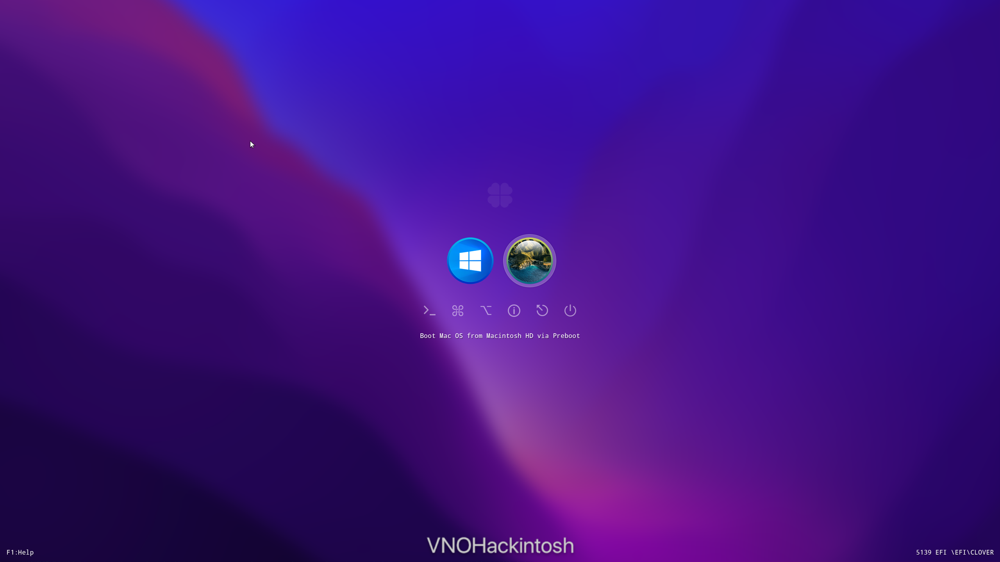

<h1 align="center"> Hackintosh the Thinkpad X1 Carbon 6th Generation Using Clover </h1>

<a href="">

<a href="https://vanhung4499.github.io/x1c6-clover-hackintosh/">
  

### Computer Spec:

| Component        | Brank                              |
| ---------------- | ---------------------------------- |
| CPU              | Intel i7 8650U                     |
| iGPU             | Intel UHD620                       |
| Lan              | Intel I219-LM                      |
| Audio            | Realtek ALC285                     |
| Ram              | 16 GB LPDDR3 2133 Mhz              |
| Wifi + Bluetooth | BCM943602CS + adapter              |
| NVME             | SAMSUNG 970 EVO PLUS 250 GB        |
| SmBios           | MacBookPro 15,2                    |
| BootLoader       | Clover 5139                        |
| macOS            | Big Sur 11.5.2                     |

### What works and What doesn't or WIP:

- [x] Intel UHD620 iGPU with Backlight
- [x] Intel UHD620 iGPU HDMI Output
- [x] ALC285 Audio (Speaker, HP, Jack)
- [x] All USB-A and USB-C Ports
- [x] SpeedStep / Sleep / Wake
- [x] HID Key PWRB & SLPB 
- [x] Synaptics SMBus Touchpad with gesture
- [x] Keyboard (PS2-Internal) with backlight
- [x] All FN Key
- [x] Wi-Fi and Bluetooth BCM943602CS (with adapter)
- [x] Intel I219-LM 
- [x] SSD NVME Slot-2 PciE Gen3x4 
- [x] Micro SD Cardreader (USB-Internal)
- [x] WebCam (USB-Internal)
- [x] All Sensors CPU, IGPU, BATTERY, NVME, FAN
- [x] ACPI Battery
- [x] NVRAM (Native)
- [x] Dualboot with Windows 11

## Installation

When I use X1C6 Opencore EFI from [Tylernguyen repos](https://github.com/tylernguyen/x1c6-hackintosh), Windows crash after 2 minutes, so I switched from opencore to clover.

All ACPI files are taken from his repos, I modified some hotpatch.

Please follow his guide to install macOS to SSD!

## Credits

- [Apple](https://apple.com) for macOS.
- [Acidanthera](https://github.com/acidanthera) for OpenCore and all the lovely hackintosh work.
- [Tylernguyen](https://github.com/tylernguyen/x1c6-hackintosh) for his x1c6 opencore repos
For great and detailed guides.
- [VNOHackintosh](https://facebook.com/vnohackintosh) Support group for installation and post installation.
